# Collection-Based References Analysis Report

## Overall Summary

- Total records analyzed: 674,473
- Unique collections identified: 104
- Overall PRONI references: 16,157 (2.40%)

### Top 10 Collections Overall

- PROI: 121,447 references (18.01%)
- VRTI: 117,809 references (17.47%)
- NAI: 110,539 references (16.39%)
- TNA: 39,744 references (5.89%)
- ROD: 39,325 references (5.83%)
- LBC: 33,155 references (4.92%)
- DGZ: 32,334 references (4.79%)
- CIRCLE: 30,274 references (4.49%)
- PRONI: 16,157 references (2.40%)
- Bodleian: 13,396 references (1.99%)

## Monthly Breakdown

### Aug 2024

**General Statistics:**
- Total requests: 47,640
- Unique reference codes: 34,383
- PRONI references: 1,192 (2.50%)

**Real User Statistics:**
- Real user requests: 14,840
- Real user PRONI references: 596 (4.02%)

**Top 5 Collections:**
- PROI: 10,099 (21.20%)
- NAI: 9,462 (19.86%)
- CIRCLE: 3,851 (8.08%)
- FernsDA: 2,926 (6.14%)
- TNA: 2,764 (5.80%)

**Top 5 Collections (Real Users Only):**
- NAI: 3,023 (20.37%)
- PROI: 2,592 (17.47%)
- VRTI: 1,553 (10.46%)
- LBC: 852 (5.74%)
- TNA: 724 (4.88%)

**Visualizations:**
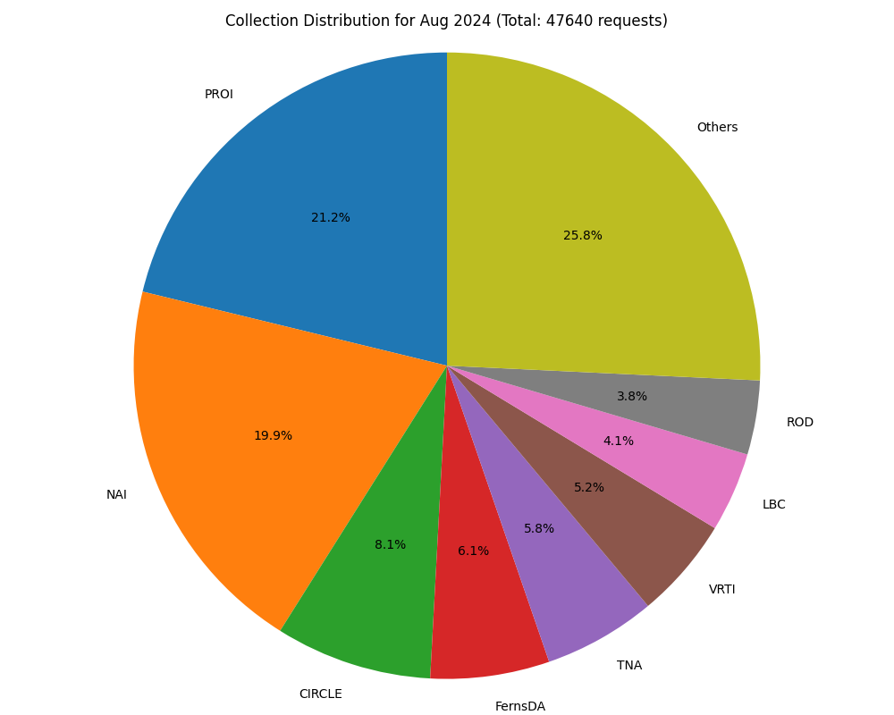

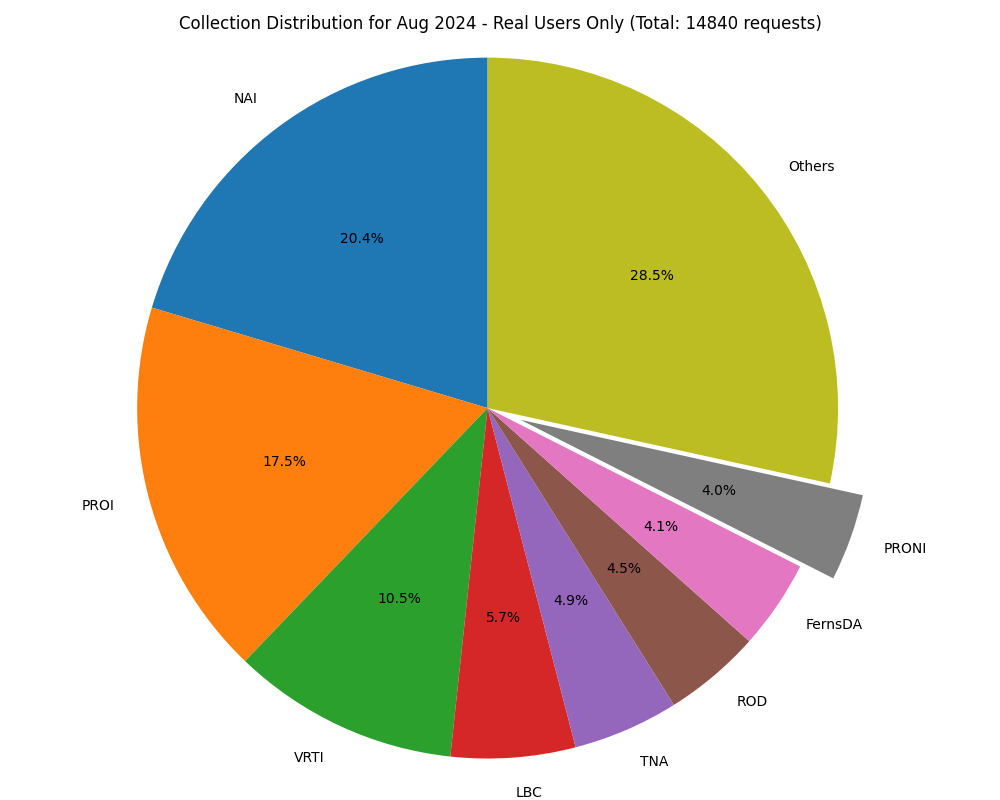

### Sep 2024

**General Statistics:**
- Total requests: 98,730
- Unique reference codes: 60,619
- PRONI references: 2,884 (2.92%)

**Real User Statistics:**
- Real user requests: 39,093
- Real user PRONI references: 1,278 (3.27%)

**Top 5 Collections:**
- NAI: 22,215 (22.50%)
- PROI: 19,643 (19.90%)
- VRTI: 7,668 (7.77%)
- ROD: 6,610 (6.70%)
- TNA: 5,679 (5.75%)

**Top 5 Collections (Real Users Only):**
- NAI: 8,177 (20.92%)
- VRTI: 5,714 (14.62%)
- PROI: 5,512 (14.10%)
- ROD: 4,002 (10.24%)
- DGZ: 3,216 (8.23%)

**Visualizations:**
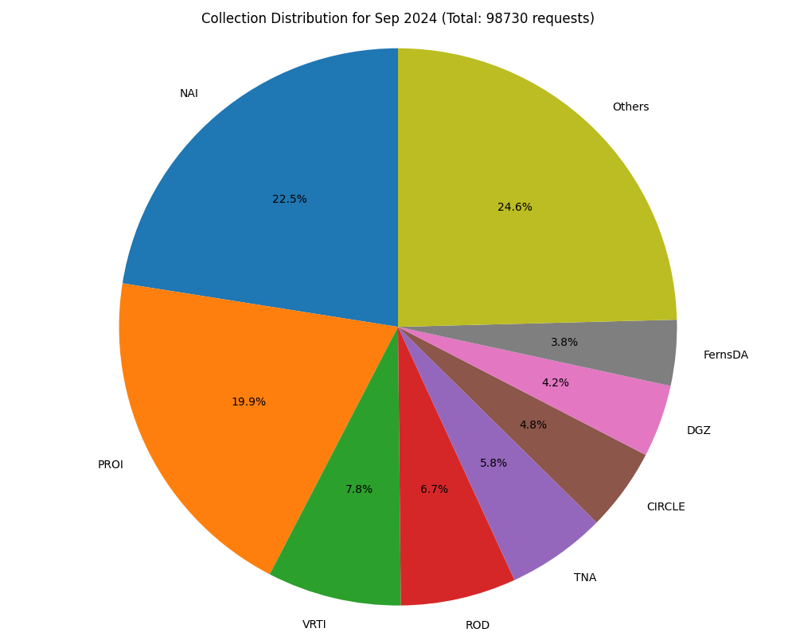

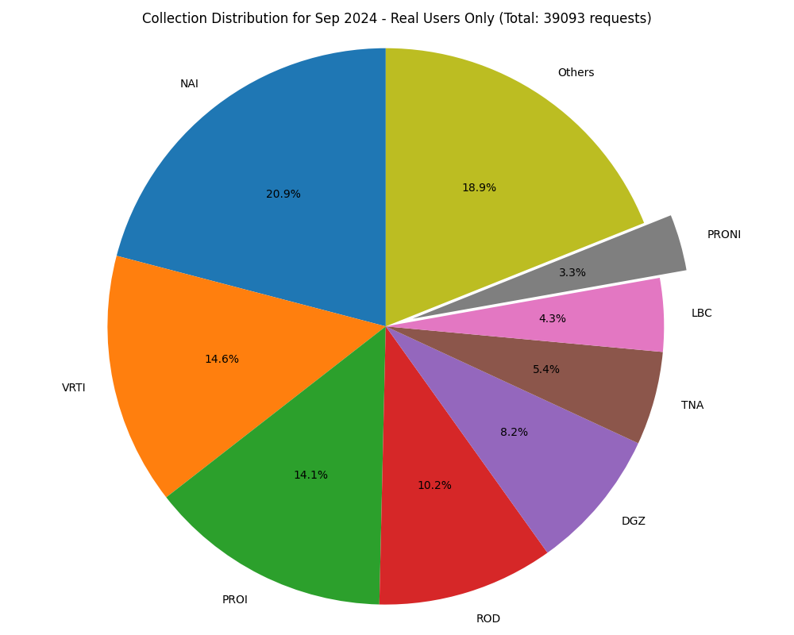

### Oct 2024

**General Statistics:**
- Total requests: 68,689
- Unique reference codes: 39,913
- PRONI references: 1,920 (2.80%)

**Real User Statistics:**
- Real user requests: 44,123
- Real user PRONI references: 1,348 (3.06%)

**Top 5 Collections:**
- NAI: 11,393 (16.59%)
- VRTI: 10,311 (15.01%)
- PROI: 9,747 (14.19%)
- ROD: 9,125 (13.28%)
- TNA: 3,546 (5.16%)

**Top 5 Collections (Real Users Only):**
- ROD: 7,994 (18.12%)
- VRTI: 6,932 (15.71%)
- NAI: 6,603 (14.96%)
- PROI: 5,167 (11.71%)
- IMC: 2,419 (5.48%)

**Visualizations:**
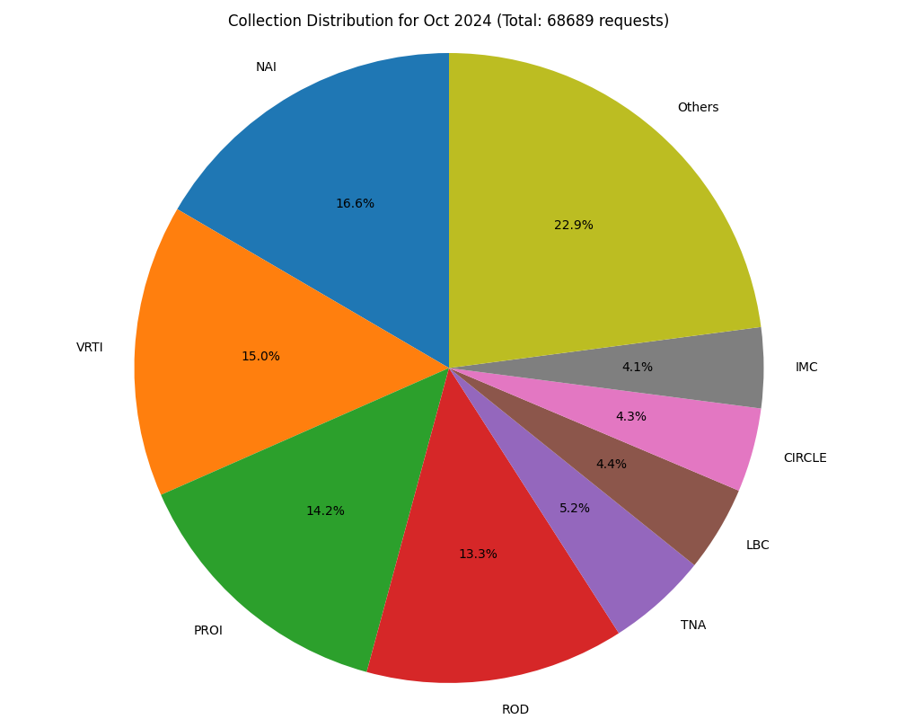

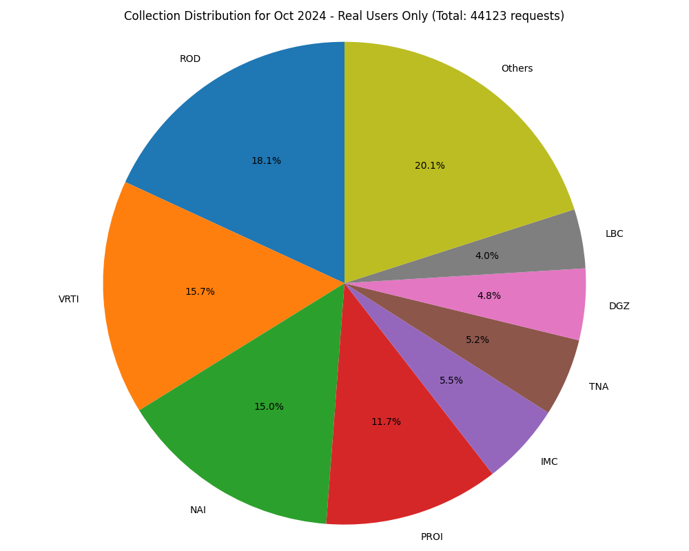

### Nov 2024

**General Statistics:**
- Total requests: 107,530
- Unique reference codes: 73,226
- PRONI references: 2,628 (2.44%)

**Real User Statistics:**
- Real user requests: 38,288
- Real user PRONI references: 1,281 (3.35%)

**Top 5 Collections:**
- PROI: 19,336 (17.98%)
- NAI: 16,430 (15.28%)
- VRTI: 14,352 (13.35%)
- CIRCLE: 7,033 (6.54%)
- LBC: 6,125 (5.70%)

**Top 5 Collections (Real Users Only):**
- VRTI: 7,365 (19.24%)
- PROI: 5,341 (13.95%)
- NAI: 5,299 (13.84%)
- LBC: 3,847 (10.05%)
- PUB: 3,435 (8.97%)

**Visualizations:**
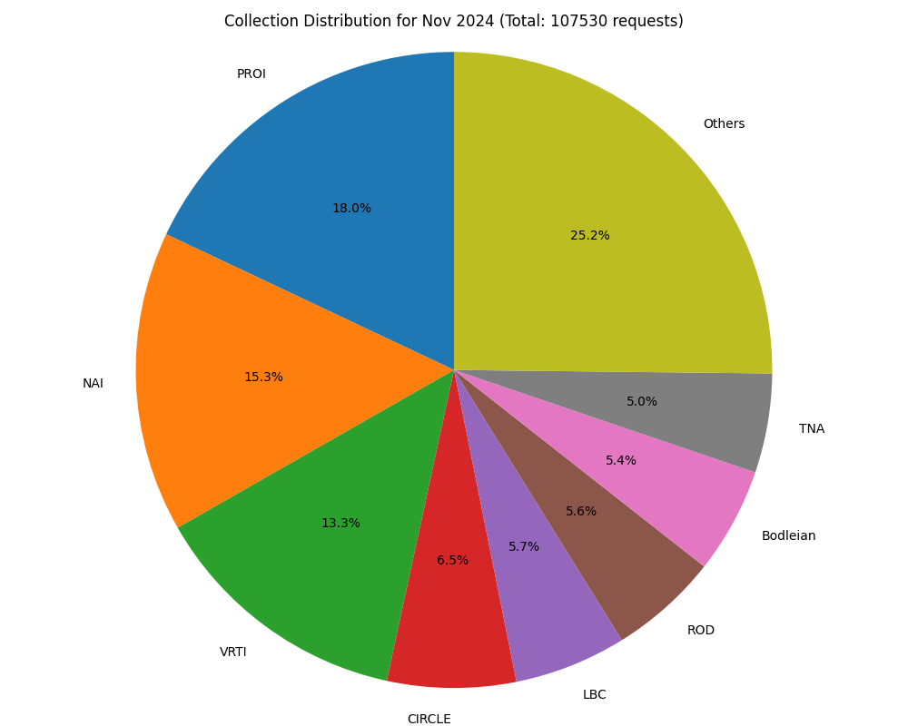

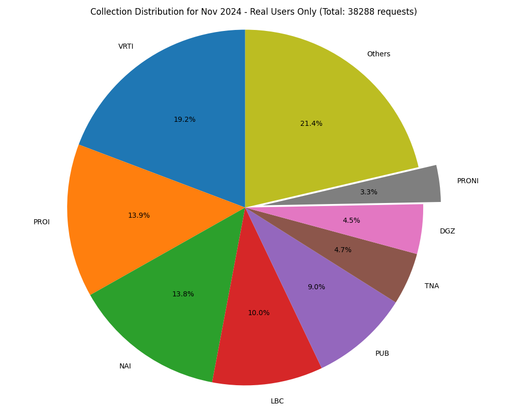

### Dec 2024

**General Statistics:**
- Total requests: 104,990
- Unique reference codes: 59,952
- PRONI references: 2,171 (2.07%)

**Real User Statistics:**
- Real user requests: 48,184
- Real user PRONI references: 1,327 (2.75%)

**Top 5 Collections:**
- VRTI: 30,163 (28.73%)
- PROI: 14,875 (14.17%)
- NAI: 11,562 (11.01%)
- DGZ: 11,351 (10.81%)
- TNA: 6,924 (6.59%)

**Top 5 Collections (Real Users Only):**
- VRTI: 10,337 (21.45%)
- DGZ: 8,739 (18.14%)
- PROI: 5,730 (11.89%)
- NAI: 5,488 (11.39%)
- TNA: 4,780 (9.92%)

**Visualizations:**
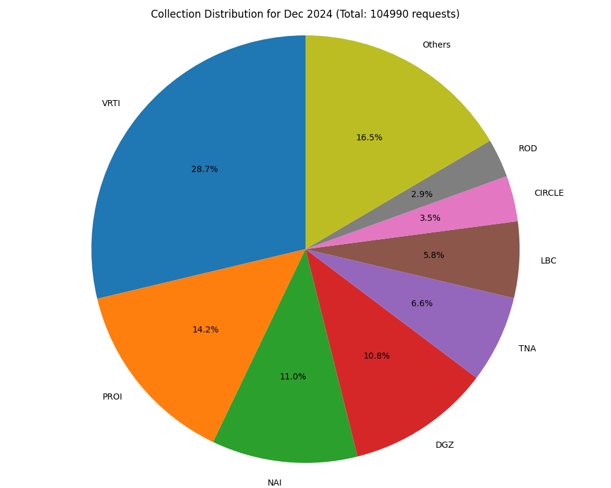

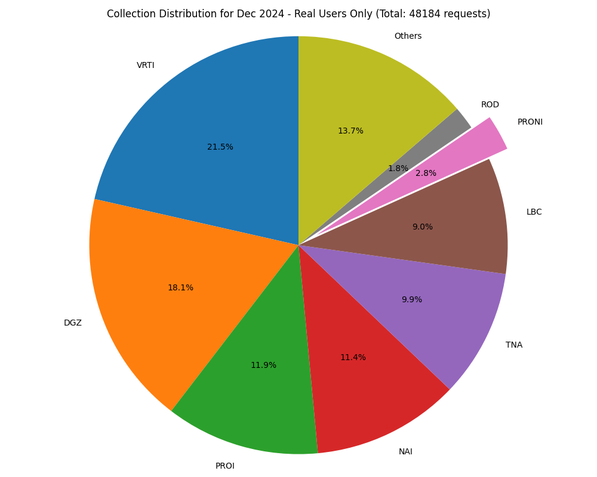

### Jan 2025

**General Statistics:**
- Total requests: 91,131
- Unique reference codes: 47,783
- PRONI references: 1,951 (2.14%)

**Real User Statistics:**
- Real user requests: 49,287
- Real user PRONI references: 1,193 (2.42%)

**Top 5 Collections:**
- VRTI: 19,930 (21.87%)
- PROI: 17,954 (19.70%)
- NAI: 13,061 (14.33%)
- LBC: 6,043 (6.63%)
- DGZ: 5,393 (5.92%)

**Top 5 Collections (Real Users Only):**
- VRTI: 10,397 (21.09%)
- PROI: 8,528 (17.30%)
- NAI: 6,997 (14.20%)
- LBC: 4,618 (9.37%)
- DGZ: 4,262 (8.65%)

**Visualizations:**
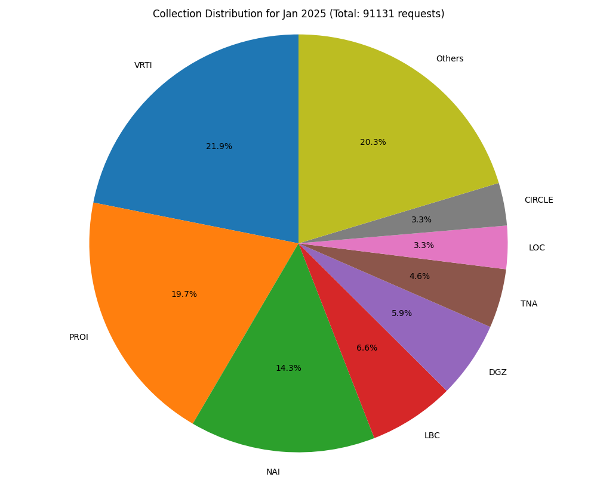

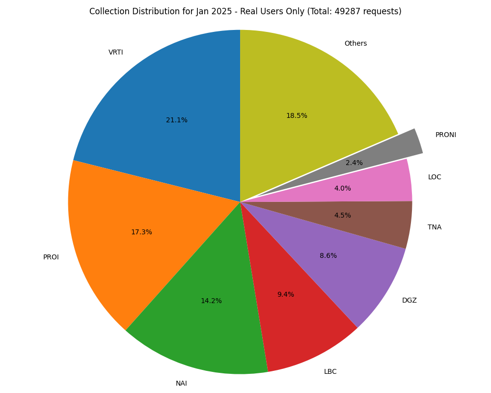

### Feb 2025

**General Statistics:**
- Total requests: 128,259
- Unique reference codes: 60,671
- PRONI references: 2,798 (2.18%)

**Real User Statistics:**
- Real user requests: 65,749
- Real user PRONI references: 1,578 (2.40%)

**Top 5 Collections:**
- VRTI: 26,031 (20.30%)
- PROI: 23,967 (18.69%)
- NAI: 22,915 (17.87%)
- TNA: 9,759 (7.61%)
- ROD: 8,977 (7.00%)

**Top 5 Collections (Real Users Only):**
- NAI: 14,535 (22.11%)
- PROI: 12,812 (19.49%)
- VRTI: 8,849 (13.46%)
- TNA: 6,624 (10.07%)
- ROD: 6,513 (9.91%)

**Visualizations:**
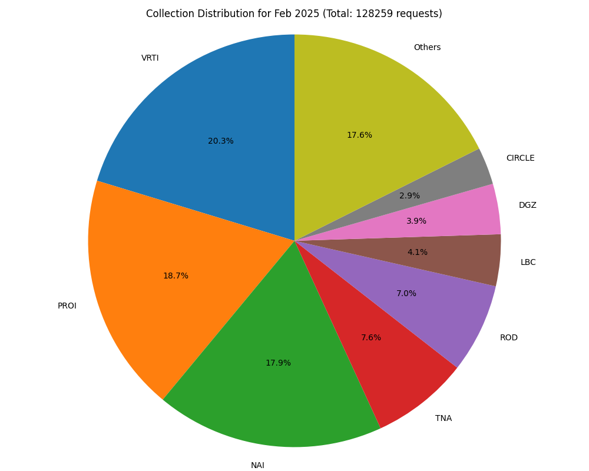

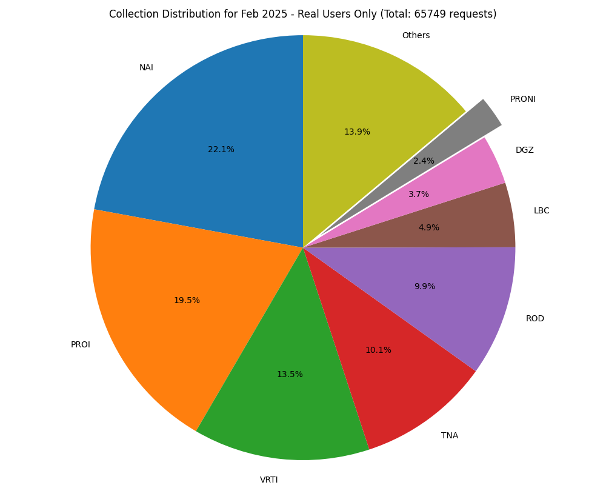

### Mar 2025

**General Statistics:**
- Total requests: 27,504
- Unique reference codes: 19,550
- PRONI references: 613 (2.23%)

**Real User Statistics:**
- Real user requests: 10,596
- Real user PRONI references: 330 (3.11%)

**Top 5 Collections:**
- VRTI: 6,860 (24.94%)
- PROI: 5,826 (21.18%)
- NAI: 3,501 (12.73%)
- TNA: 1,487 (5.41%)
- CIRCLE: 1,313 (4.77%)

**Top 5 Collections (Real Users Only):**
- PROI: 3,016 (28.46%)
- NAI: 1,702 (16.06%)
- VRTI: 1,539 (14.52%)
- TNA: 892 (8.42%)
- LBC: 646 (6.10%)

**Visualizations:**
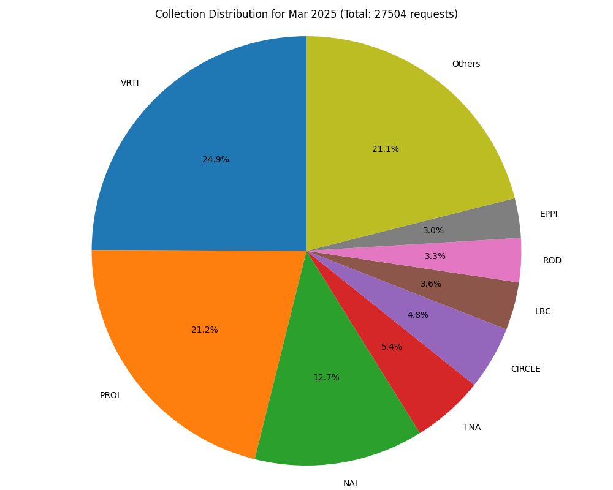

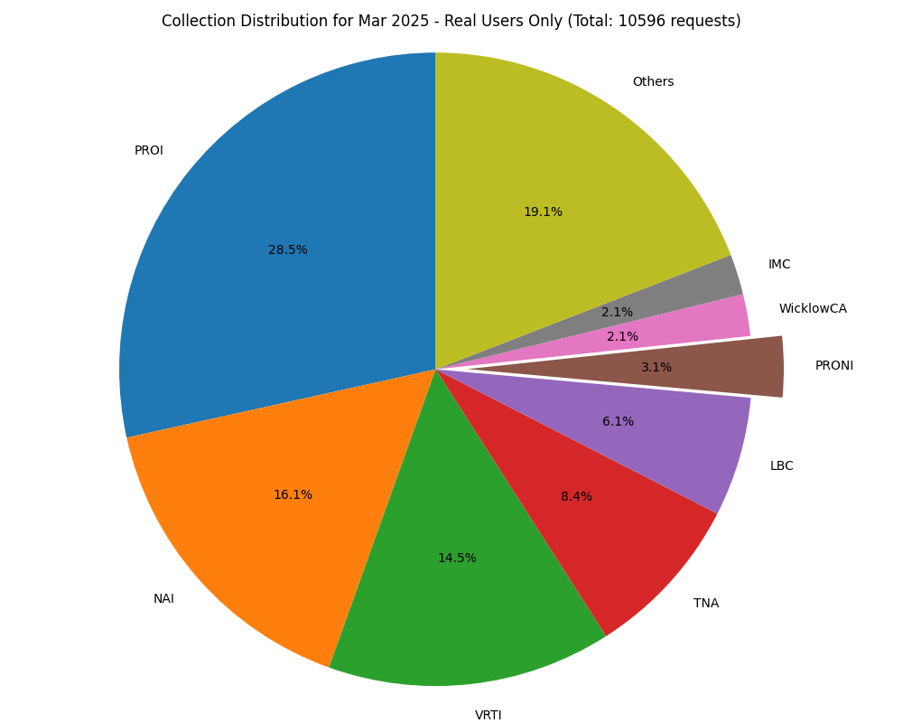

## Trends and Insights

1. PRONI references show a decreasing trend over the analyzed period.
2. On average, PRONI references constitute 2.41% of all requests.
3. In comparison with other major collections:
   - PROI represents 18.38% of requests on average
   - VRTI represents 17.15% of requests on average
   - NAI represents 16.27% of requests on average
   - TNA represents 5.74% of requests on average
   - ROD represents 5.71% of requests on average

4. The data suggests that PRONI is not among the top 5 most accessed collections overall.

5. 55.28% of PRONI requests come from real users rather than bots, indicating strong human interest in these collections.

## Conclusion

The analysis of reference code collections provides valuable insights into usage patterns of the virtual treasury. PRONI references show consistent interest across the analyzed period, with notable variations by month. The distribution of collections reveals which institutional sources are most frequently accessed, helping to understand user interests and potentially guide future digitization efforts.