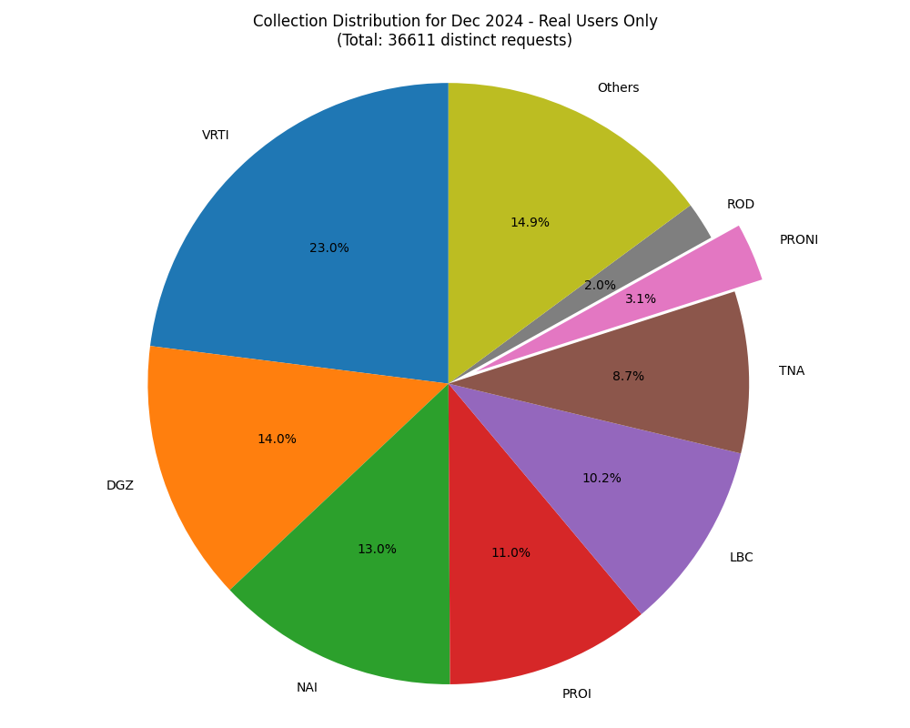
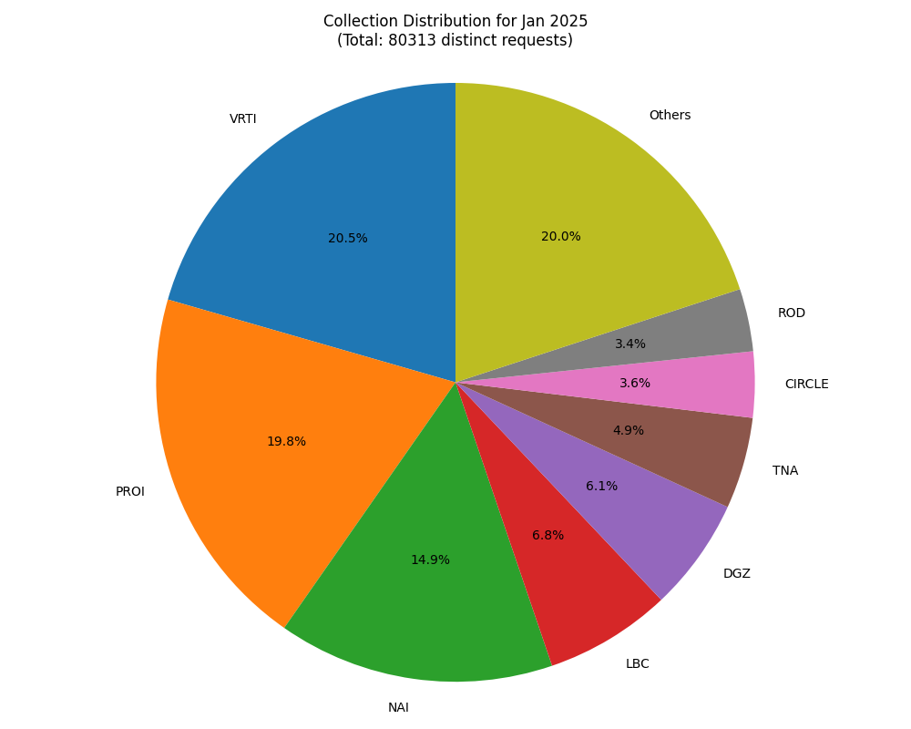

# Collection-Based References Analysis Report

*Note: This analysis counts distinct item accesses per IP per day, removing duplicate visits to the same item by the same user on the same day.*

## Raw vs. Distinct Request Comparison

The following table compares the total number of requests against distinct requests per IP per day:

| Month | All Requests | Distinct Requests | Ratio (%) |
|-------|-------------|-------------------|----------|
| Aug 2024 | 47,640 | 43,792 | 91.92% |
| Dec 2024 | 104,990 | 90,857 | 86.54% |
| Feb 2025 | 128,259 | 109,408 | 85.30% |
| Jan 2025 | 91,131 | 80,313 | 88.13% |
| Mar 2025 | 27,504 | 24,270 | 88.24% |
| Nov 2024 | 107,530 | 99,837 | 92.85% |
| Oct 2024 | 68,689 | 59,099 | 86.04% |
| Sep 2024 | 98,730 | 89,176 | 90.32% |

## Overall Summary

- Total distinct requests analyzed: 596,752
- Unique collections identified: 104
- Overall PRONI references: 14,824 (2.48%)

### Top 10 Collections Overall

- PROI: 110,622 distinct references (18.54%)
- VRTI: 100,491 distinct references (16.84%)
- NAI: 96,450 distinct references (16.16%)
- ROD: 35,521 distinct references (5.95%)
- TNA: 34,946 distinct references (5.86%)
- LBC: 30,320 distinct references (5.08%)
- CIRCLE: 29,274 distinct references (4.91%)
- DGZ: 26,677 distinct references (4.47%)
- PRONI: 14,824 distinct references (2.48%)
- Bodleian: 12,985 distinct references (2.18%)

## Monthly Breakdown

### Aug 2024

**General Statistics:**
- Total distinct requests: 43,792
- Unique reference codes: 34,383
- PRONI references: 1,118 (2.55%)

**Real User Statistics:**
- Real user distinct requests: 11,736
- Real user PRONI references: 526 (4.48%)

**Top 5 Collections:**
- PROI: 9,543 (21.79%)
- NAI: 9,021 (20.60%)
- CIRCLE: 3,761 (8.59%)
- TNA: 2,559 (5.84%)
- VRTI: 2,110 (4.82%)

**Top 5 Collections (Real Users Only):**
- NAI: 2,619 (22.32%)
- PROI: 2,076 (17.69%)
- VRTI: 1,189 (10.13%)
- LBC: 692 (5.90%)
- ROD: 590 (5.03%)

**Visualizations:**

### Sep 2024

**General Statistics:**
- Total distinct requests: 89,176
- Unique reference codes: 60,619
- PRONI references: 2,694 (3.02%)

**Real User Statistics:**
- Real user distinct requests: 31,363
- Real user PRONI references: 1,102 (3.51%)

**Top 5 Collections:**
- NAI: 20,349 (22.82%)
- PROI: 18,552 (20.80%)
- VRTI: 6,447 (7.23%)
- ROD: 5,553 (6.23%)
- TNA: 5,481 (6.15%)

**Top 5 Collections (Real Users Only):**
- NAI: 7,011 (22.35%)
- VRTI: 4,569 (14.57%)
- PROI: 4,527 (14.43%)
- ROD: 2,961 (9.44%)
- DGZ: 2,548 (8.12%)

**Visualizations:**

### Oct 2024

**General Statistics:**
- Total distinct requests: 59,099
- Unique reference codes: 39,913
- PRONI references: 1,755 (2.97%)

**Real User Statistics:**
- Real user distinct requests: 34,921
- Real user PRONI references: 1,191 (3.41%)

**Top 5 Collections:**
- NAI: 9,949 (16.83%)
- VRTI: 9,219 (15.60%)
- PROI: 8,565 (14.49%)
- ROD: 7,066 (11.96%)
- TNA: 3,358 (5.68%)

**Top 5 Collections (Real Users Only):**
- ROD: 5,940 (17.01%)
- VRTI: 5,894 (16.88%)
- NAI: 5,275 (15.11%)
- PROI: 4,027 (11.53%)
- TNA: 2,119 (6.07%)

**Visualizations:**

### Nov 2024

**General Statistics:**
- Total distinct requests: 99,837
- Unique reference codes: 73,226
- PRONI references: 2,398 (2.40%)

**Real User Statistics:**
- Real user distinct requests: 31,514
- Real user PRONI references: 1,063 (3.37%)

**Top 5 Collections:**
- PROI: 17,854 (17.88%)
- NAI: 15,601 (15.63%)
- VRTI: 13,108 (13.13%)
- CIRCLE: 6,899 (6.91%)
- ROD: 5,844 (5.85%)

**Top 5 Collections (Real Users Only):**
- VRTI: 6,215 (19.72%)
- NAI: 4,591 (14.57%)
- PROI: 4,097 (13.00%)
- LBC: 3,523 (11.18%)
- PUB: 2,062 (6.54%)

**Visualizations:**

### Dec 2024

**General Statistics:**
- Total distinct requests: 90,857
- Unique reference codes: 59,952
- PRONI references: 1,964 (2.16%)

**Real User Statistics:**
- Real user distinct requests: 36,611
- Real user PRONI references: 1,141 (3.12%)

**Top 5 Collections:**
- VRTI: 26,652 (29.33%)
- PROI: 12,973 (14.28%)
- NAI: 10,722 (11.80%)
- DGZ: 7,656 (8.43%)
- LBC: 5,407 (5.95%)

**Top 5 Collections (Real Users Only):**
- VRTI: 8,421 (23.00%)
- DGZ: 5,139 (14.04%)
- NAI: 4,776 (13.05%)
- PROI: 4,033 (11.02%)
- LBC: 3,723 (10.17%)

**Visualizations:**

### Jan 2025

**General Statistics:**
- Total distinct requests: 80,313
- Unique reference codes: 47,783
- PRONI references: 1,763 (2.20%)

**Real User Statistics:**
- Real user distinct requests: 40,476
- Real user PRONI references: 1,017 (2.51%)

**Top 5 Collections:**
- VRTI: 16,495 (20.54%)
- PROI: 15,875 (19.77%)
- NAI: 11,986 (14.92%)
- LBC: 5,486 (6.83%)
- DGZ: 4,903 (6.10%)

**Top 5 Collections (Real Users Only):**
- VRTI: 8,387 (20.72%)
- PROI: 6,582 (16.26%)
- NAI: 5,987 (14.79%)
- LBC: 4,094 (10.11%)
- DGZ: 3,793 (9.37%)

**Visualizations:**

### Feb 2025

**General Statistics:**
- Total distinct requests: 109,408
- Unique reference codes: 60,671
- PRONI references: 2,575 (2.35%)

**Real User Statistics:**
- Real user distinct requests: 50,754
- Real user PRONI references: 1,393 (2.74%)

**Top 5 Collections:**
- PROI: 22,271 (20.36%)
- VRTI: 20,791 (19.00%)
- NAI: 15,715 (14.36%)
- ROD: 8,792 (8.04%)
- TNA: 7,770 (7.10%)

**Top 5 Collections (Real Users Only):**
- PROI: 11,338 (22.34%)
- NAI: 7,478 (14.73%)
- VRTI: 6,448 (12.70%)
- ROD: 6,345 (12.50%)
- TNA: 4,660 (9.18%)

**Visualizations:**

### Mar 2025

**General Statistics:**
- Total distinct requests: 24,270
- Unique reference codes: 19,550
- PRONI references: 557 (2.30%)

**Real User Statistics:**
- Real user distinct requests: 8,372
- Real user PRONI references: 277 (3.31%)

**Top 5 Collections:**
- VRTI: 5,669 (23.36%)
- PROI: 4,989 (20.56%)
- NAI: 3,107 (12.80%)
- TNA: 1,302 (5.36%)
- CIRCLE: 1,287 (5.30%)

**Top 5 Collections (Real Users Only):**
- PROI: 2,242 (26.78%)
- NAI: 1,317 (15.73%)
- VRTI: 1,173 (14.01%)
- TNA: 712 (8.50%)
- LBC: 538 (6.43%)

**Visualizations:**

## Trends and Insights

1. PRONI references show a decreasing trend over the analyzed period.
2. On average, PRONI references constitute 2.49% of all distinct requests.
3. In comparison with other major collections:
   - PROI represents 18.74% of distinct requests on average
   - VRTI represents 16.63% of distinct requests on average
   - NAI represents 16.22% of distinct requests on average
   - ROD represents 5.79% of distinct requests on average
   - TNA represents 5.77% of distinct requests on average

4. The data suggests that PRONI is not among the top 5 most accessed collections overall.

5. 52.01% of distinct PRONI requests come from real users rather than bots, indicating strong human interest in these collections.

6. On average, 88.67% of all requests are distinct (per IP per day), indicating that users typically access multiple different items rather than repeatedly viewing the same items.

## Conclusion

The analysis of distinct reference code accesses (per IP per day) provides valuable insights into actual usage patterns of the virtual treasury by filtering out repeated visits to the same items. PRONI references show consistent interest across the analyzed period, with notable variations by month. The distribution of collections reveals which institutional sources are most frequently accessed by unique users, helping to understand genuine user interests and potentially guide future digitization efforts.